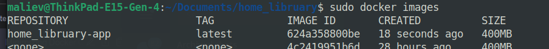
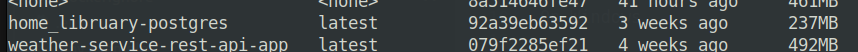

# Home library part 2

## Run docker containers
On Linux

```sudo docker compose up -d```

On Windows

```docker-compose up -d```

## Auto rebuild containers

On Linux

```npm run auto:rebuild:linux```

On Windows

```npm run auto:rebuild:windows```

Container size is less then 500mb





